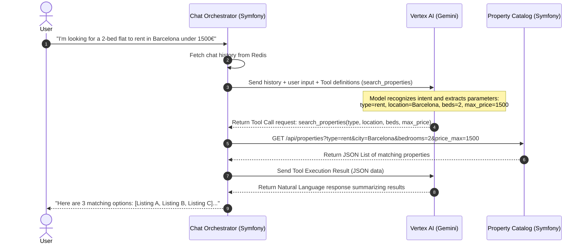

# WOLO Real Estate Chatbot: Architectural Documentation

> **Project Status:** ✅ Phase 1 & 2 Completed (Environment Setup & Property Catalog API).

This document describes the microservices architecture, technologies, and Test-Driven Development (TDD) strategy for **WOLO**, an AI-powered conversational agent that helps users find properties to rent or buy.

---

## 1. System Architecture Overview

The WOLO platform is built as an event-driven microservices application deployed on **Google Cloud Platform (GCP)**. It leverages **Symfony (PHP 8.3+)** for its robust framework capabilities, **GCP Vertex AI** (Gemini 1.5 Flash) for language processing and intent matching, and a variety of serverless GCP components for scalability and resilience.

### Architecture Diagram

```mermaid
graph TD
    Client[Client App: Web/Mobile] -->|HTTPS/WSS| APIGateway[GCP API Gateway]
    
    subgraph GCP Cloud Run (Symfony Microservices)
        APIGateway -->|Route Chat API| ChatOrchestrator[Chat Orchestrator Service]
        APIGateway -->|Route Property API| PropertyCatalog[Property Catalog Service]
        APIGateway -->|Route Lead API| LeadService[Lead & Notification Service]
    end
    
    subgraph Intelligence Layer
        ChatOrchestrator -->|SDK / REST| VertexAI[GCP Vertex AI: Gemini 1.5]
    end
    
    subgraph Data Layer
        ChatOrchestrator -->|Read/Write Session| Memorystore[GCP Memorystore: Redis]
        PropertyCatalog -->|SQL Queries| CloudSQL[(Cloud SQL: PostgreSQL)]
        PropertyCatalog -->|Embeddings Search| CloudSQL
        LeadService -->|Write Leads| Firestore[(Cloud Firestore)]
    end
    
    subgraph Event Bus
        ChatOrchestrator -->|Publish lead_captured| PubSub[GCP Pub/Sub]
        PubSub -->|Subscribe| LeadService
    end

    classDef gcp fill:#4285F4,stroke:#333,stroke-width:2px,color:#fff;
    classDef symfony fill:#000,stroke:#333,stroke-width:2px,color:#fff;
    classDef db fill:#34A853,stroke:#333,stroke-width:2px,color:#fff;
    
    class APIGateway,VertexAI,PubSub gcp;
    class ChatOrchestrator,PropertyCatalog,LeadService symfony;
    class Memorystore,CloudSQL,Firestore db;
```

---

## 2. Microservices Breakdown

### A. Chat Orchestrator Service (Symfony 7)
*   **Role**: Entrypoint for user communication. Manages conversational sessions, holds the state of active chats, queries the LLM, and triggers appropriate actions (Tool Calling).
*   **Key Dependencies**: `symfony/ux-turbo`, `symfony/messenger`, `google/cloud-vertex-ai`.
*   **State Management**: Uses **GCP Memorystore (Redis)** to cache the conversation history and context, feeding the last $N$ messages to the LLM to maintain continuity.

### B. Property Catalog Service (Symfony 7)
*   **Role**: Serves as the system of record for properties (for sale or rent). It provides search endpoints, filtering, and property details.
*   **Key Dependencies**: `doctrine/orm`, `doctrine/doctrine-bundle`, `pgvector` extension for PostgreSQL.
*   **Search Engine**: Powered by **Cloud SQL (PostgreSQL)**. To handle semantic searches (e.g., *"a cozy apartment with lots of natural light"*), text embeddings are generated for property descriptions and queried using the `pgvector` extension.

### C. Lead & Notification Service (Symfony 7)
*   **Role**: Captures user interest, contact information, and coordinates scheduled viewings. It asynchronously processes notifications (e.g., sending emails to agents and users).
*   **Key Dependencies**: `symfony/mailer`, `google/cloud-pubsub`.
*   **Database**: Uses **Cloud Firestore** for flexible, document-based storage of lead records and scheduled events.

---

## 3. LLM Integration & Function Calling Flow

The system uses **GCP Vertex AI (Gemini 1.5 Flash)** to process natural language queries. Rather than letting the LLM hallucinate properties, we utilize **Function Calling (Tools)** to interface with our structured APIs.

### Sequence Flow: Querying Properties



---

## 4. Test-Driven Development (TDD) Strategy

We adhere strictly to TDD principles to ensure that every microservice is modular, verifiable, and robust. The testing strategy is organized into a pyramid structure:

```
      / \      
     /   \     End-to-End Tests (Behat / Cypress)
    /     \    
   /-------\   
  /         \  Integration & Contract Tests (PHPUnit / Pact)
 /-----------\ 
/             \
------------- Unit Tests (PHPUnit: Mocking external APIs/DB)
```

### TDD Workflow Rules
1.  **Write the Test First (Red)**: Before writing a single line of business logic, write a failing unit or integration test that defines the expected behavior.
2.  **Make it Pass (Green)**: Write the simplest implementation code to make the test pass.
3.  **Refactor (Clean Code)**: Improve the code structure, remove duplication, and optimize performance while ensuring all tests remain green.

### Service-Specific TDD Implementations

#### 1. Unit Testing (PHPUnit)
*   **Focus**: Isolated domain business logic, custom validators, and helper utilities.
*   **Mocking**: All network calls (Vertex AI API, database connections, Pub/Sub publishers) must be mocked using Symfony's mock objects or `Symfony\Component\HttpClient\MockHttpClient`.
*   *Example Test Case*: Verifying that the `BudgetFilter` domain model correctly flags search requests with invalid price ranges.

#### 2. Integration Testing (Symfony WebTestCase)
*   **Focus**: API endpoints, database queries, and middleware.
*   **Database**: Uses an isolated SQLite database in-memory or a dedicated PostgreSQL test container (via Docker/Testcontainers) to run database schema migrations and verify Doctrine repositories.
*   *Example Test Case*: Verifying that `GET /api/properties` correctly filters and returns properties from the database matching the criteria.

#### 3. Contract Testing (Pact / OpenAPI specs)
*   **Focus**: Guaranteeing that changes in the `Property Catalog Service` API don't break the client contracts expected by the `Chat Orchestrator`.
*   **Execution**: Autogenerate OpenAPI schemas from controllers and validate them in tests using schema validation libraries.

#### 4. End-to-End / Functional Testing (Behat / Symfony Panthère)
*   **Focus**: User flows and chat orchestrations.
*   **Mocking**: External APIs (like Gemini Vertex AI) are stubbed with deterministic responses for specific inputs to prevent test instability and API costs.
*   *Example Scenario*:
    ```gherkin
    Scenario: User asks for a property and gets listings
      Given the property "Penthouse in Gracia" exists with price 1200
      When the user says "Find me a penthouse in Gracia for rent"
      Then the chatbot should display "Penthouse in Gracia" with price "1,200€/month"
    ```

---

## 5. GCP Deployment & CI/CD Pipeline

To maintain high availability and seamless scalability, the microservices are deployed on **GCP Cloud Run**.

*   **CI/CD Engine**: GitHub Actions / GCP Cloud Build.
*   **Deployment Pipeline Steps**:
    1.  **Code Commit**: Developers merge feature branches into `main` after local TDD passes.
    2.  **Lint & Static Analysis**: Run `PHPStan` (level 8) and `PHP-CS-Fixer` to enforce coding standards.
    3.  **Test Execution**: Run PHPUnit test suites (Unit, Integration, Contracts). *Deployments are halted if a single test fails.*
    4.  **Containerization**: Build production-optimized Docker images using multi-stage builds.
    5.  **Artifact Registry**: Push Docker images to GCP Artifact Registry.
    6.  **Cloud Run Deployment**: Deploy to GCP Cloud Run with traffic splitting (canary releases).

### Active Cloud Run Deployments
The microservices are built and running on GCP Cloud Run (project: `iot-microservices-gcp` / region: `europe-west1`):
*   **Property Catalog Service**: [property-catalog-aevnltclea-ew.a.run.app](https://property-catalog-aevnltclea-ew.a.run.app)
*   **Chat Orchestrator Service**: [chat-orchestrator-aevnltclea-ew.a.run.app](https://chat-orchestrator-aevnltclea-ew.a.run.app)
*   **Lead & Notification Service**: [lead-service-aevnltclea-ew.a.run.app](https://lead-service-aevnltclea-ew.a.run.app)

---

## 6. Project Progress & Status

The development of the WOLO platform is structured into seven phases, following a strict Test-Driven Development (TDD) cycle. Below is the current progress of each phase:

### Progress Summary
- **Overall Completion**: `85.7%` (6/7 phases complete)
- **Current Phase**: Phase 7 (Visual Chat Interface Implementation)

| Phase | Description | Status | Completion | Key Deliverables |
| :--- | :--- | :---: | :---: | :--- |
| **Phase 1** | Project Setup & Test Infrastructure | 🟢 Complete | 100% | Symfony skeletons, Docker Compose environment, PHPUnit configuration, green baseline environment tests. |
| **Phase 2** | Property Catalog Service (TDD) | 🟢 Complete | 100% | Property Entity, `pgvector` semantic search, REST API endpoints. |
| **Phase 3** | Chat Orchestrator Service & Vertex AI | 🟢 Complete | 100% | Chat Session Manager (Redis), Vertex AI client wrapper, function calling, `/api/chat` endpoint. |
| **Phase 4** | Lead & Notification Service (TDD) | 🟢 Complete | 100% | Lead capture handler, Pub/Sub consumer, Symfony Mailer notifications. |
| **Phase 5** | Infrastructure & Deployment Automation | 🟢 Complete | 100% | Terraform infrastructure code for GCP, CI/CD pipeline (GitHub Actions). |
| **Phase 6** | End-to-End Validation & Release | 🟢 Complete | 100% | E2E system testing, security audits & rate limiting, production deployment. |
| **Phase 7** | Visual Chat Interface (Web UI) | 🟡 Next | 0% | Web Chat page (`GET /chat`), interactive property cards, Panthère E2E tests, Cloud Run frontend redeployment. |

### Completed Milestones
- **[x] Milestone 1: Scaffold Complete**
  - Initialized three independent Symfony microservices ([chat-orchestrator](file:///Users/sergioabad/Desktop/ProjectsToWorkOn/WOLO/chat-orchestrator), [lead-service](file:///Users/sergioabad/Desktop/ProjectsToWorkOn/WOLO/lead-service), and [property-catalog](file:///Users/sergioabad/Desktop/ProjectsToWorkOn/WOLO/property-catalog)) within a unified repository layout.
  - Configured a local Docker environment with a PostgreSQL database containing `pgvector`, Redis for chat session caching, and the GCP Pub/Sub emulator.
  - Setup local testing suites (PHPUnit) with in-memory SQLite configurations and verified baseline assertions pass green.
- **[x] Milestone 2-5: Core Functionality & GCP Deployment Complete**
  - Fully implemented the microservices using TDD, including semantic search, chat session management, and asynchronous lead dispatching.
  - Successfully deployed all three microservices to live GCP Cloud Run instances (active endpoints documented in Section 5).

### Next Actions
1. **Frontend UI styling (Task 7.1)**: Design a clean, premium visual chat interface layout.
2. **GET /chat Web Controller (Task 7.2)**: Implement the web route in the Chat Orchestrator to render the visual UI.

For a detailed task-by-task breakdown and to track ongoing tasks, see [TODO.md](file:///Users/sergioabad/Desktop/ProjectsToWorkOn/WOLO/TODO.md).
For the project Gantt chart, weekly schedule, and milestones details, see [timeline.md](file:///Users/sergioabad/Desktop/ProjectsToWorkOn/WOLO/timeline.md).
For GCP monthly cost estimations and budget planning, see [COST.md](file:///Users/sergioabad/Desktop/ProjectsToWorkOn/WOLO/COST.md).
