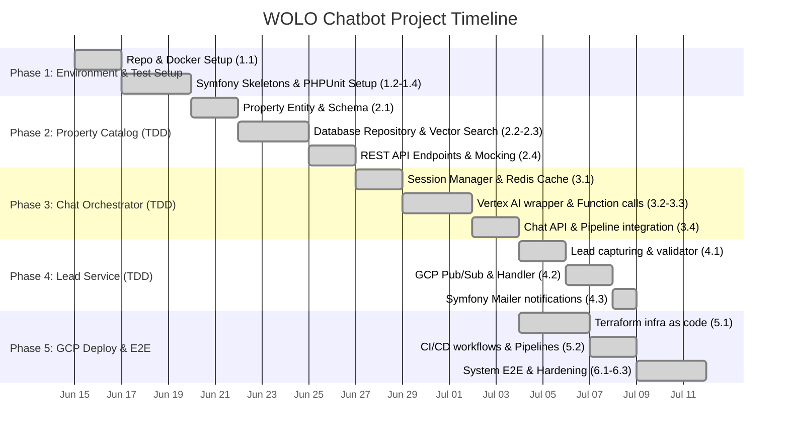

# WOLO Project Timeline & Schedule

This document outlines the project schedule, resource allocation, and milestones for developing the WOLO Real Estate Chatbot. The timeline is structured around a **4-week (20 business days)** delivery cycle using an agile, TDD-focused approach.

---

## 1. Gantt Chart (Development Roadmap)

The following Gantt diagram illustrates the sequencing, dependencies, and duration of each development phase.

---

## 2. Weekly Tasks and Estimates

The table below breaks down the tasks by estimated duration in business days (1 day = 8 working hours).

| Phase | Task ID | Task Description | Estimated Effort | Dependencies | Status |
| :--- | :--- | :--- | :---: | :--- | :---: |
| **Phase 1** | 1.1 | Repository setup & Docker Compose configuration | 2 Days | None | ✅ Done |
| | 1.2 | Property Catalog skeleton & PHPUnit config | 1 Day | 1.1 | ✅ Done |
| | 1.3 | Chat Orchestrator skeleton & testing config | 1 Day | 1.1 | ✅ Done |
| | 1.4 | Lead Service skeleton & mock configuration | 1 Day | 1.1 | ✅ Done |
| **Phase 2** | 2.1 | TDD: Property Entity design & validation constraints | 2 Days | 1.2 | ✅ Done |
| | 2.2 | TDD: Doctrine repository & search filters | 2 Days | 2.1 | ✅ Done |
| | 2.3 | TDD: `pgvector` semantic search query implementation | 1 Day | 2.2 | ✅ Done |
| | 2.4 | TDD: Catalog REST API endpoints & schemas | 2 Days | 2.3 | ✅ Done |
| **Phase 3** | 3.1 | TDD: Chat Session Manager (Redis integration) | 2 Days | 2.4 | ✅ Done |
| | 3.2 | TDD: Vertex AI HTTP Client wrapper implementation | 1 Day | 1.3 | ✅ Done |
| | 3.3 | TDD: LLM Function calling (tool executions dispatch) | 2 Days | 3.2 | ✅ Done |
| | 3.4 | TDD: Main conversation endpoint (`/api/chat`) | 2 Days | 3.1, 3.3 | ✅ Done |
| **Phase 4** | 4.1 | TDD: Lead submission logic & domain validation | 2 Days | 3.4 | ✅ Done |
| | 4.2 | TDD: GCP Pub/Sub listener & Messenger handler | 2 Days | 4.1 | ✅ Done |
| | 4.3 | TDD: Notification dispatcher (Symfony Mailer) | 1 Day | 4.2 | ✅ Done |
| **Phase 5** | 5.1 | Infrastructure setup (Terraform scripting for GCP Run/SQL/PubSub) | 3 Days | 3.4 | ✅ Done |
| | 5.2 | Automated pipeline workflows (CI/CD GitHub Actions) | 2 Days | 5.1 | ✅ Done |
| **Phase 6** | 6.1 | E2E Integration and system latency profiling | 1 Day | 4.3, 5.2 | ✅ Done |
| | 6.2 | Security checking (Rate limits, CORS, composer audit) | 1 Day | 6.1 | ✅ Done |
| | 6.3 | Production deployment & post-deployment smoke tests | 1 Day | 6.2 | ✅ Done |
| **Total** | | | **29 Days (Parallelized to 20 days)** | | |

---

## 3. Milestones & Deliverables

1.  **Milestone 1: Scaffold Complete (Day 5)**
    *   *Deliverable*: 3 Symfony services running locally in Docker containers. Standard testing suites configured and executing successfully with green baseline results.
2.  **Milestone 2: Catalog Service Online (Day 9)**
    *   *Deliverable*: Functional Property Catalog API. Supports structured queries (e.g. price limits, location) and basic vector searches. Covered by 90%+ unit/integration test coverage.
3.  **Milestone 3: Chat Engine & Tool Call validation (Day 15)**
    *   *Deliverable*: Chat Orchestration backend responding to questions, storing history in Redis, and executing tool calls to retrieve catalog data.
4.  **Milestone 4: Cloud Ready & Event-Driven (Day 18)**
    *   *Deliverable*: Lead generation process complete. Message flows asynchronously from Chat Orchestrator to Lead Service using Pub/Sub. Terraform code successfully verified.
5.  **Milestone 5: Production Release (Day 20)**
    *   *Deliverable*: All services deployed to GCP Cloud Run. CI/CD pipelines automate testing and deployment. Public API Gateway configured, secure, and ready for client usage.

---

## 4. Risks & Mitigations

*   **Risk 1: Vertex AI Latency**:
    *   *Mitigation*: Implement aggressive caching of property search results in Redis. Cache LLM prompts and reuse system context where possible. Use Gemini 1.5 Flash instead of Pro for faster response times in standard questions.
*   **Risk 2: Semantic search quality**:
    *   *Mitigation*: Design robust fallback flows. If vector search results have low similarity scores, fall back to standard keyword/field matching to ensure the user always receives properties.
*   **Risk 3: API costs during TDD**:
    *   *Mitigation*: Intercept and mock Vertex AI API calls in the CI/CD pipeline and integration tests. Live model tests are only run as part of nightly integration tests, not on every local test run.
